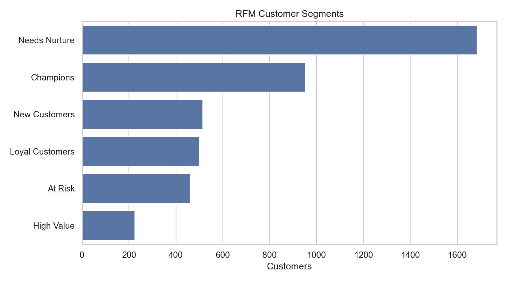
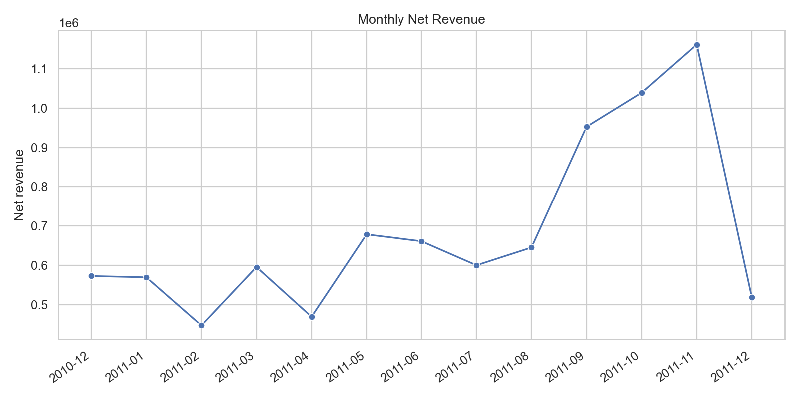
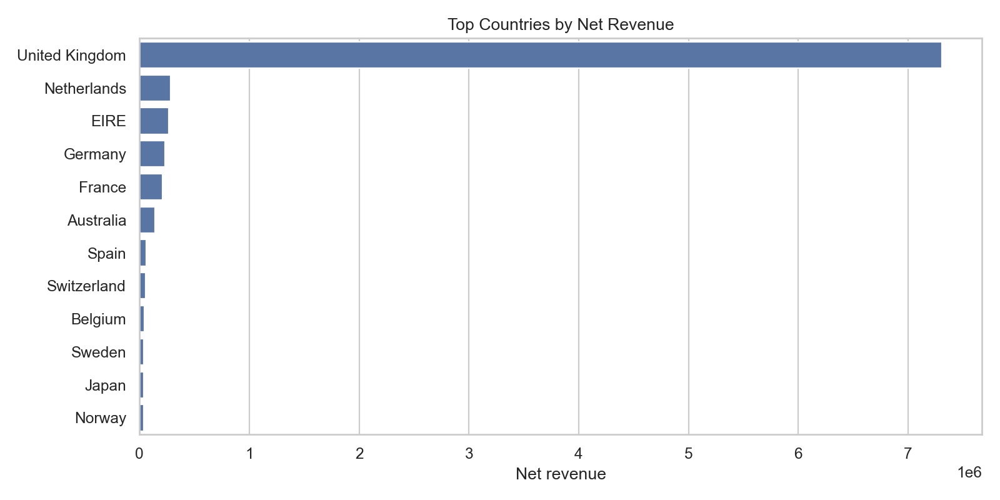
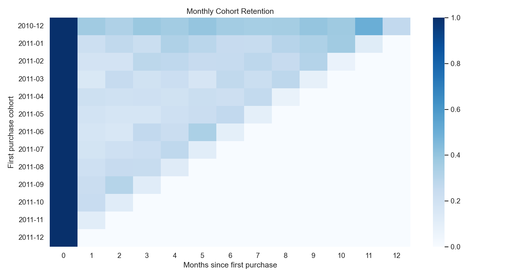

# E-Commerce Revenue, Customer Segmentation, and Retention Analytics

A Power BI and Python analytics case study using the UCI Online Retail dataset.

## Project Snapshot

| | |
|---|---|
| **Business problem** | Identify the markets, customers, and products driving clean revenue after returns, cancellations, missing IDs, and postage distortions are removed. |
| **Quantified result** | Cleaned **541,909 rows** into **397,884 valid sales**, measured **8.91M net revenue**, and identified **953 Champions** plus **461 At Risk** customers. |
| **Method** | Python and SQL data-quality checks, revenue analysis, RFM segmentation, cohort retention, DAX measures, and a Power BI model. |
| **Demo** | Open `dashboard/ecommerce_performance_dashboard.pbix`; the reproducible charts are available under `reports/figures/`. |
| **Limitations** | The 2010–2011 dataset lacks marketing spend, margin, product cost, inventory, and web-session data, so profitability and campaign ROI cannot be inferred. |
| **Reproduce** | `pip install -r requirements.txt` → `python scripts/analyze_retail.py`. |



## Business Problem

An online retailer needs to understand which markets, customers, and products are actually driving clean revenue after accounting for cancellations, returns, missing customer IDs, and postage/shipping rows that can distort product analysis.

This project answers:

- Which markets drive revenue volume vs high-value orders?
- Which customer groups should receive loyalty or win-back campaigns?
- How large are data-quality and return/cancellation issues?
- Which products perform best after separating postage from product revenue?
- How does monthly seasonality affect planning?

## Executive Summary

After cleaning `541,909` raw transaction rows:

- Valid sales rows: `397,884`
- Net revenue: `8,911,408`
- Product revenue excluding postage: `8,821,698`
- Orders: `18,532`
- Customers: `4,338`
- Average order value: `480.87`
- Top revenue market: `United Kingdom`
- Highest-AOV market with meaningful volume: `Netherlands` at `3,036.66` AOV
- November revenue was `66.1%` above the non-December monthly average
- RFM segmentation found `953` Champion customers and `461` At Risk customers

## Why Cleaning Matters

The raw dataset contains:

- `135,080` rows missing `CustomerID`
- `9,288` cancelled invoice rows
- `10,624` negative-quantity rows
- `2,517` zero or negative price rows
- `1,962` postage/shipping rows

Without separating these cases, a dashboard can overstate revenue, mis-rank products, and hide return leakage.

## Visual Evidence








## Recommendations

1. Treat the UK as the revenue-volume base, but test targeted campaigns in high-AOV markets such as the Netherlands.
2. Separate postage/shipping from product sales reporting so product rankings reflect actual merchandise performance.
3. Plan inventory and promotions around the November seasonal spike.
4. Use RFM segments for lifecycle campaigns:
   - Champions: loyalty and VIP offers.
   - At Risk: win-back incentives.
   - New Customers: second-purchase campaigns.
5. Track returns and cancellations as revenue leakage instead of reporting only gross sales.

## Repository Structure

```text
.
|-- README.md
|-- dashboard/
|   `-- ecommerce_performance_dashboard.pbix
|-- data/
|   |-- raw/
|   |   `-- online_retail.xlsx
|   `-- processed/
|-- docs/
|   |-- dashboard_redesign_plan.md
|   |-- data_cleaning.md
|   |-- data_dictionary.md
|   |-- dax_measures.md
|   `-- power_query_steps.md
|-- reports/
|   |-- analysis_summary.json
|   |-- executive_summary.md
|   `-- figures/
|-- scripts/
|   `-- analyze_retail.py
|-- screenshots/
|-- sql/
`-- tests/
```

## Reproduce the Python Analysis

```bash
python -m venv .venv
.venv\Scripts\activate
pip install -r requirements.txt
python scripts/analyze_retail.py
```

On macOS or Linux:

```bash
source .venv/bin/activate
```

The script writes:

- cleaned transaction outputs in `data/processed/`
- `reports/analysis_summary.json`
- `reports/executive_summary.md`
- charts in `reports/figures/`

## SQL and Power BI Assets

- `sql/` contains SQL equivalents for data quality, cleaning, revenue, country, RFM, cohort, and returns analysis.
- `docs/dax_measures.md` contains recommended DAX measures.
- `docs/power_query_steps.md` documents the Power Query cleaning logic to apply in Power BI.
- `docs/dashboard_redesign_plan.md` provides a page-by-page dashboard upgrade plan.

## Current Power BI Status

The existing `.pbix` file is preserved in `dashboard/`. The supporting analytics layer is now upgraded, but the Power BI visual layout still needs to be manually updated in Power BI Desktop using the documented measures and cleaning steps.

## Limitations

- The dataset is from 2010-2011 and may not reflect current e-commerce behavior.
- There is no marketing spend, acquisition channel, margin, product cost, inventory, or web-session data.
- Profitability and campaign ROI cannot be concluded from this dataset alone.
- Missing customer IDs limit customer-level analysis.

## Resume Bullet

Built an e-commerce analytics case study using Power BI, Python, SQL, and DAX; cleaned 541K+ retail transactions, separated returns/postage from product revenue, built RFM and cohort retention analysis, and translated findings into market, lifecycle, and revenue-leakage recommendations.
